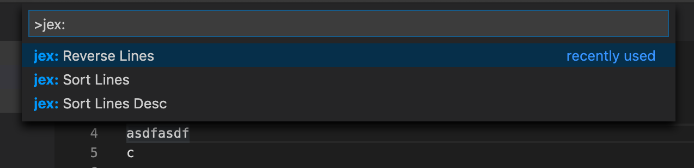

# vscode-jex-sort

This is an extension that allows you to sort/reorder lines various ways.

## Features

* reverse
* sort naturally
* sort reverse/unnaturally(?)

## Requirements

none

## Extension Settings

none

## Known Issues

This is activated always.

## Release Notes

### 1.0.0

Initial release
